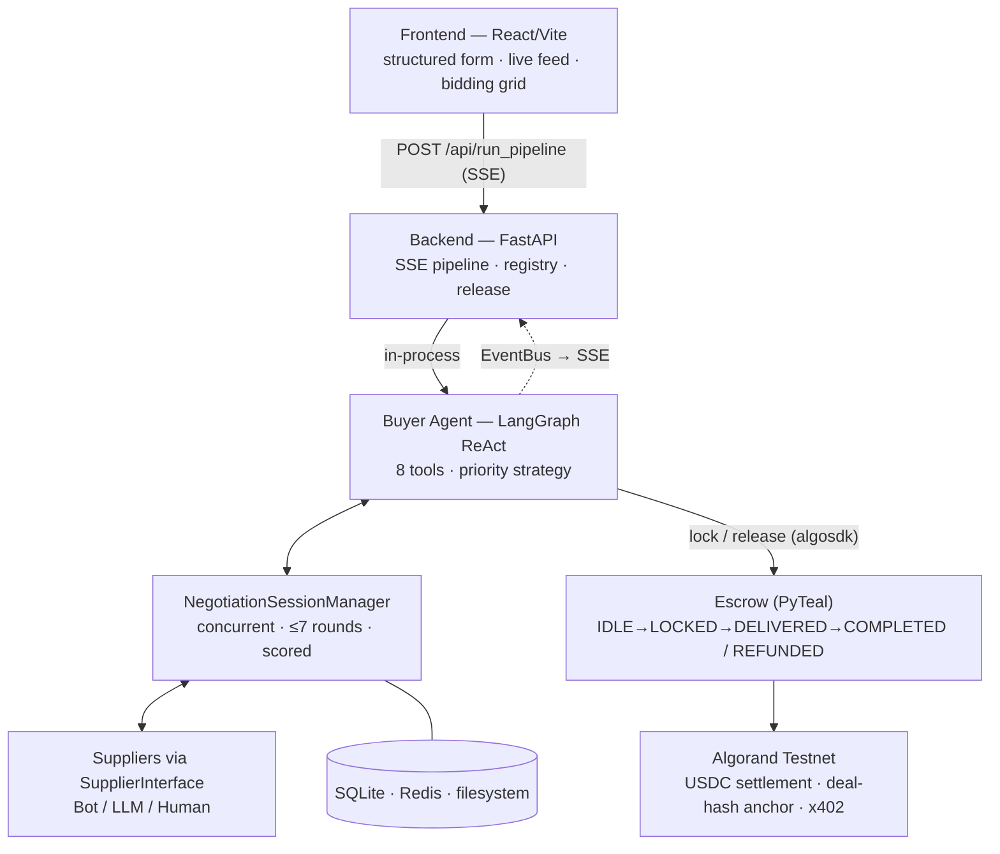

# AgentTrade — Architecture Diagram

Slide-ready system diagram for the Technical table (*"frontend → backend → blockchain"*). The ASCII version screenshots cleanly onto a slide; the Mermaid version renders on GitHub.

---

## System architecture (the hero diagram)

```
┌─────────────────────────────────────────────────────────────────────────────┐
│  FRONTEND — React 19 + Vite + Tailwind          (https://agent-trade.live)    │
│  Structured USD form · live pipeline stages · multi-agent bidding grid ·      │
│  negotiation timeline · on-chain verification (explorer links)                │
└───────────────────────────────┬───────────────────────────────────────────────┘
                                 │  HTTPS · POST /api/run_pipeline  ──► SSE stream
┌───────────────────────────────▼───────────────────────────────────────────────┐
│  BACKEND — FastAPI  (Docker on DigitalOcean · nginx · SSE, no buffering)       │
│  pipeline stream · marketplace registry · delivery/release endpoint            │
└───────────────────────────────┬───────────────────────────────────────────────┘
                                 │  in-process
┌───────────────────────────────▼───────────────────────────────────────────────┐
│  AGENT + PROTOCOL LAYER                                                         │
│                                                                                │
│   ┌──────────────────────────┐      SupplierInterface (ABC)                    │
│   │  Autonomous Buyer Agent  │      ┌────────┬────────┬────────┐               │
│   │  LangGraph ReAct · 8 tools│◄────►│  Bot   │  LLM   │ Human  │  suppliers    │
│   │  priority-driven strategy │      └────────┴────────┴────────┘               │
│   └────────────┬─────────────┘                                                 │
│                │                                                                │
│   NegotiationSessionManager — concurrent · ≤7 rounds · multi-variable · scored │
│   EventBus (in-process) ──► SSE                                                 │
│                                                                                │
│   LLM: DigitalOcean GenAI ▸ Groq ▸ Gemini ▸ Anthropic  (failover + key rotate) │
└───────────────────────────────┬───────────────────────────────────────────────┘
                                 │  algosdk · USDC group transaction
┌───────────────────────────────▼───────────────────────────────────────────────┐
│  ALGORAND  (Testnet)                                                           │
│   Escrow smart contract (PyTeal):  IDLE → LOCKED → DELIVERED → COMPLETED        │
│                                                  ↘ REFUNDED (on timeout)        │
│   USDC (ASA) settlement · SHA-256 deal hash anchored · x402 (HTTP-402) payments │
└─────────────────────────────────────────────────────────────────────────────────┘

   DATA / STATE  ──  SQLite (agents · suppliers · RFQs · quotes · deals ·
                     negotiation sessions/rounds)  ·  Redis (optional, SQLite
                     fallback)  ·  filesystem (agreements · delivery proofs · logs)
```

---

## Procurement lifecycle (request → settlement)

```
Buyer        Backend        Buyer Agent          Suppliers           Algorand
  │  form ────► │               │                    │                   │
  │             │── run ──────► │                    │                   │
  │             │               │── discover ───────►│                   │
  │             │               │── RFQs (concurrent)►│                   │
  │             │               │◄── quotes ─────────│                   │
  │             │               │  score (priority)  │                   │
  │             │               │── counters (≤7) ──►│                   │
  │             │               │◄── accept ─────────│                   │
  │             │               │── lock_escrow ─────┼── USDC + hash ───►│ LOCKED
  │  ◄── SSE ───│◄── events ────│                    │                   │
  │             │               │   (supplier delivers)─ proof hash ────►│ DELIVERED
  │             │── release ────┼────────────────────┼── USDC → seller ─►│ COMPLETED
  │  ◄── txids + explorer links │                    │                   │
```

---

## Mermaid (renders on GitHub)



---

**On-chain vs off-chain (Hash Bridge):** only fingerprints go on-chain — agent wallet addresses, the SHA-256 deal-terms hash, the USDC amount, the delivery-proof hash, and contract state transitions. Everything large/private (full RFQs, quote breakdowns, negotiation transcripts, agreements) stays off-chain in SQLite/filesystem, verifiable by hash.
